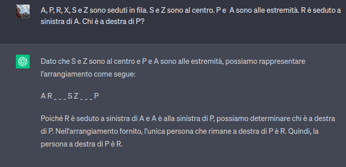

# Abstraction

### Question 1

- **USER**: ***A, P, R, X, S e Z sono seduti in fila. S e Z sono al centro. P e  A sono alle estremità. R è seduto a sinistra di A. Chi è a destra di P?***

- **CHAT**: Dato che S e Z sono al centro e P e A sono alle estremità, possiamo rappresentare l'arrangiamento come segue:

	A R _ _ _ S Z _ _ _ P

	Poiché R è seduto a sinistra di A e A è alla sinistra di P, possiamo determinare chi è a destra di P. Nell'arrangiamento fornito, l'unica persona che rimane a destra di P è R. Quindi, la persona a destra di P è R.
	

### Question 2

- **USER**: ***Nella mia libreria ho 4 libri ne leggo uno, quanti ne rimangono nella mia libreria?***

- **CHAT**: Se nella tua libreria hai inizialmente 4 libri e ne leggi uno, ti rimarranno 3 libri nella tua libreria. 

