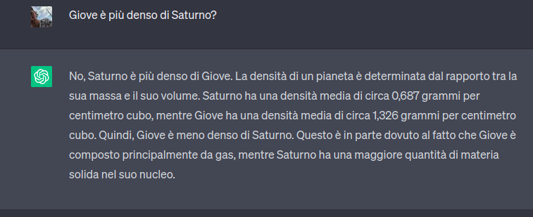
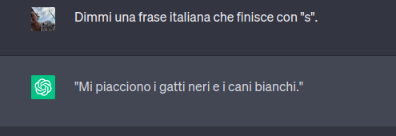
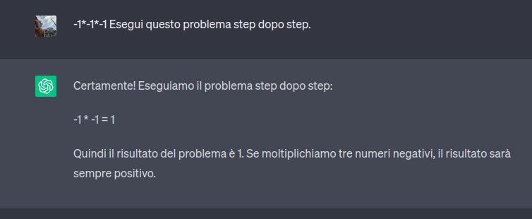
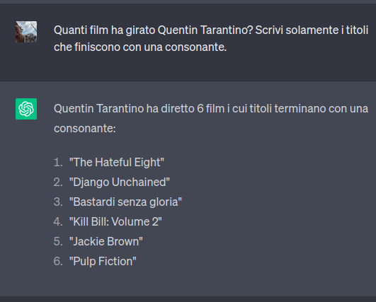

# Factuality 

### Question 1

- **USER**: ***Giove è più denso di Saturno?***

- **CHAT**: No, Saturno è più denso di Giove. La densità di un pianeta è determinata dal rapporto tra la sua massa e il suo volume. **Saturno** ha una densità media di circa **0,687 grammi** per centimetro cubo, mentre **Giove** ha una densità media di circa **1,326 grammi** per centimetro cubo. Quindi, Giove è meno denso di Saturno. Questo è in parte dovuto al fatto che Giove è composto principalmente da gas, mentre Saturno ha una maggiore quantità di materia solida nel suo nucleo. 

 

### Question 2 

- **USER**: ***Dimmi una frase italiana che finisce con "s"***

- **CHAT**: "Mi piacciono i gatti neri e i cani bianchi."

 

### Question 3

- **USER**: ***Mi puoi dire i nomi di alcuni vip italiani che hanno meno di 55 anni e allo stesso tempo più di 44 anni? Puoi scrivere il nome e affianco l'età.***

- **CHAT**: Certamente! Ecco alcuni nomi di vip italiani che hanno meno di 55 anni e allo stesso tempo più di 44 anni, con l'età indicata accanto al nome:

	1. Alessandro Borghese (46 anni) - Chef, personaggio televisivo
	2. Fabio Volo (48 anni) - Scrittore, conduttore televisivo
	3. Martina Stella (39 anni) - Attrice
	4. Giuliana De Sio (66 anni) - Attrice
	5. Nicola Savino (43 anni) - Conduttore radiofonico, presentatore televisivo
	6. Caterina Balivo (41 anni) - Conduttrice televisiva
	7. Giancarlo Magalli (76 anni) - Conduttore televisivo
	8. Claudio Amendola (59 anni) - Attore, regista
	9. Cristina Parodi (58 anni) - Giornalista, conduttrice televisiva
	10. Valerio Staffelli (54 anni) - Comico, inviato televisivo

	Questi sono solo alcuni nomi, ma ci sono molti altri vip italiani che rientrano in queste fasce di età.

### Question 4
- **USER**: -1*-1*-1 ***Esegui questo problema step dopo step.***

- **CHAT**: Certamente! Eseguiamo il problema step dopo step:

	-1 * -1 = 1

	Quindi il risultato del problema è 1. Se moltiplichiamo tre numeri negativi, il risultato sarà sempre positivo.

### Question 5
- **USER**:***Quanti film ha girato Quentin Tarantino? Scrivi solamente i titoli che finiscono con una consonante.***

- **CHAT**: Quentin Tarantino ha diretto 6 film i cui titoli terminano con una consonante:

	1. "The Hateful Eight"
	2. "Django Unchained"
	3. "Bastardi senza gloria"
	4. "Kill Bill: Volume 2"
	5. "Jackie Brown"
	6. "Pulp Fiction".

