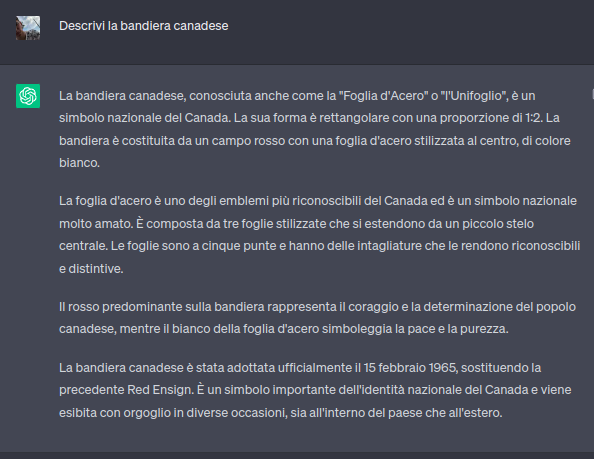

# Factuality 

### Question 1
- **USER**:***Descrivi la bandiera canadese.***

- **CHAT**:
	La bandiera canadese, conosciuta anche come la "Foglia d'Acero" o "l'Unifoglio", è un simbolo nazionale del Canada. La sua forma è rettangolare con una proporzione di 1:2. La bandiera è costituita da un campo rosso con una foglia d'acero stilizzata al centro, di colore bianco.

	La foglia d'acero è uno degli emblemi più riconoscibili del Canada ed è un simbolo nazionale molto amato. È composta da tre foglie stilizzate che si estendono da un piccolo stelo centrale. Le foglie sono a cinque punte e hanno delle intagliature che le rendono riconoscibili e distintive.

	Il rosso predominante sulla bandiera rappresenta il coraggio e la determinazione del popolo canadese, mentre il bianco della foglia d'acero simboleggia la pace e la purezza.

	La bandiera canadese è stata adottata ufficialmente il 15 febbraio 1965, sostituendo la precedente Red Ensign. È un simbolo importante dell'identità nazionale del Canada e viene esibita con orgoglio in diverse occasioni, sia all'interno del paese che all'estero.

