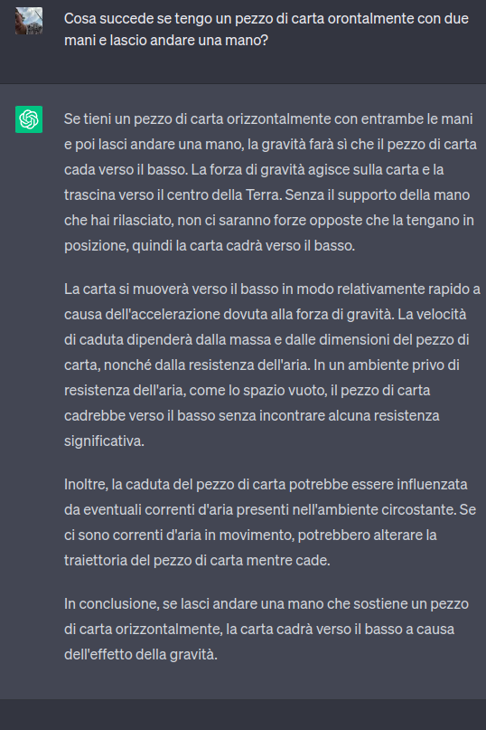

# Reasoning 

### Question 1

- **USER**: ***Cosa succede se tengo un pezzo di carta orontalmente con due mani e lascio andare una mano?***

- **CHAT**: 
	Se tieni un pezzo di carta orizzontalmente con entrambe le mani e poi lasci andare una mano, la gravità farà sì che il pezzo di carta cada verso il basso. La forza di gravità agisce sulla carta e la trascina verso il centro della Terra. Senza il supporto della mano che hai rilasciato, non ci saranno forze opposte che la tengano in posizione, quindi la carta cadrà verso il basso.

	La carta si muoverà verso il basso in modo relativamente rapido a causa dell'accelerazione dovuta alla forza di gravità. La velocità di caduta dipenderà dalla massa e dalle dimensioni del pezzo di carta, nonché dalla resistenza dell'aria. In un ambiente privo di resistenza dell'aria, come lo spazio vuoto, il pezzo di carta cadrebbe verso il basso senza incontrare alcuna resistenza significativa.

	Inoltre, la caduta del pezzo di carta potrebbe essere influenzata da eventuali correnti d'aria presenti nell'ambiente circostante. Se ci sono correnti d'aria in movimento, potrebbero alterare la traiettoria del pezzo di carta mentre cade.

	In conclusione, se lasci andare una mano che sostiene un pezzo di carta orizzontalmente, la carta cadrà verso il basso a causa dell'effetto della gravità.

