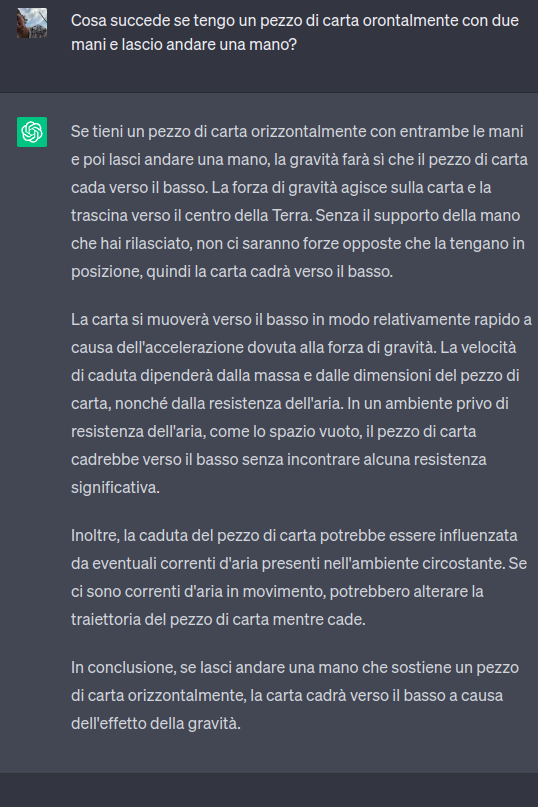

# Reasoning 

### Question 1

- **USER**: ***A, P, R, X, S e Z sono seduti in fila. S e Z sono al centro. P e  A sono alle estremità. R è seduto a sinistra di A. Chi è a destra di P?***

- **CHAT**: Dato che S e Z sono al centro e P e A sono alle estremità, possiamo rappresentare l'arrangiamento come segue:

	A R _ _ _ S Z _ _ _ P

	Poiché R è seduto a sinistra di A e A è alla sinistra di P, possiamo determinare chi è a destra di P. Nell'arrangiamento fornito, l'unica persona che rimane a destra di P è R. Quindi, la persona a destra di P è R.

### Question 2

- **USER**: ***Nella mia libreria ho 4 libri ne leggo uno, quanti ne rimangono nella mia libreria?***

- **CHAT**: Se nella tua libreria hai inizialmente 4 libri e ne leggi uno, ti rimarranno 3 libri nella tua libreria. 

### Question 3

- **USER**: ***Una quercia ha 3 rami, ognuno dei quali ne ha due. Se ogni rametto ha due ciliege, quante ciliege ci sono in tutto l'albero?***

- **CHAT**:
	Se la quercia ha 3 rami e ogni ramo ha 2 sottorami, allora abbiamo un totale di 3 rami * 2 sottorami = 6 sottorami.

	Se ogni sottoramo ha 2 ciliege, allora abbiamo 6 sottorami * 2 ciliege = 12 ciliege in tutto l'albero.
	

- **SOLUTION**: La quercia non produce ciliege.

### Question 1

- **USER**: ***Cosa succede se tengo un pezzo di carta orontalmente con due mani e lascio andare una mano?***

- **CHAT**: 
	Se tieni un pezzo di carta orizzontalmente con entrambe le mani e poi lasci andare una mano, la gravità farà sì che il pezzo di carta cada verso il basso. La forza di gravità agisce sulla carta e la trascina verso il centro della Terra. Senza il supporto della mano che hai rilasciato, non ci saranno forze opposte che la tengano in posizione, quindi la carta cadrà verso il basso.

	La carta si muoverà verso il basso in modo relativamente rapido a causa dell'accelerazione dovuta alla forza di gravità. La velocità di caduta dipenderà dalla massa e dalle dimensioni del pezzo di carta, nonché dalla resistenza dell'aria. In un ambiente privo di resistenza dell'aria, come lo spazio vuoto, il pezzo di carta cadrebbe verso il basso senza incontrare alcuna resistenza significativa.

	Inoltre, la caduta del pezzo di carta potrebbe essere influenzata da eventuali correnti d'aria presenti nell'ambiente circostante. Se ci sono correnti d'aria in movimento, potrebbero alterare la traiettoria del pezzo di carta mentre cade.

	In conclusione, se lasci andare una mano che sostiene un pezzo di carta orizzontalmente, la carta cadrà verso il basso a causa dell'effetto della gravità.

### Question 2

- **USER**: ***4 auto arrivano a Tel Aviv in due ore. Quanto tempo ci mettono 6 auto?***

- **CHAT**: 
	Se 4 auto impiegano due ore per arrivare a Tel Aviv, possiamo calcolare il tempo che ci vorrà per 6 auto utilizzando una proporzione.

	Possiamo impostare la proporzione come segue:

	4 auto → 2 ore
	6 auto → x ore

	Utilizzando la proporzione, possiamo stabilire che:

	4 auto ÷ 6 auto = 2 ore ÷ x ore

	Semplificando l'equazione, otteniamo:

	2/3 = 2/x

	Moltiplicando entrambi i lati per x, otteniamo:

	2x = 6

	Dividendo entrambi i lati per 2, otteniamo:

	x = 3

	Quindi, se 4 auto impiegano 2 ore, 6 auto impiegheranno 3 ore per arrivare a Tel Aviv.
	

	

### Question 3

- **USER**: ***Esegui questo conto step dopo step: 241 - (-241) + 1***

- **CHAT**: 
	1. Inizia con l'espressione: 241 - (-241) + 1
	2. Affronta prima l'operazione tra parentesi. Quando si ha un segno meno davanti a un numero, è equivalente a moltiplicare quel numero per -1. Quindi, -(-241) diventa 241. L'espressione ora diventa: 241 - 241 + 1
	3. Prosegui con l'operazione di sottrazione tra 241 e 241. Poiché i due numeri sono uguali, la loro differenza è 0. L'espressione ora diventa: 0 + 1
	4. Infine, esegui l'operazione di addizione tra 0 e 1. La somma di 0 e 1 è 1.

	Quindi, il risultato finale è 1: 241 - (-241) + 1 = 1.
	

